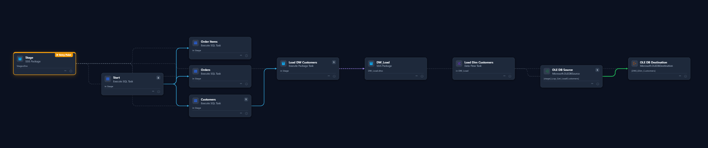
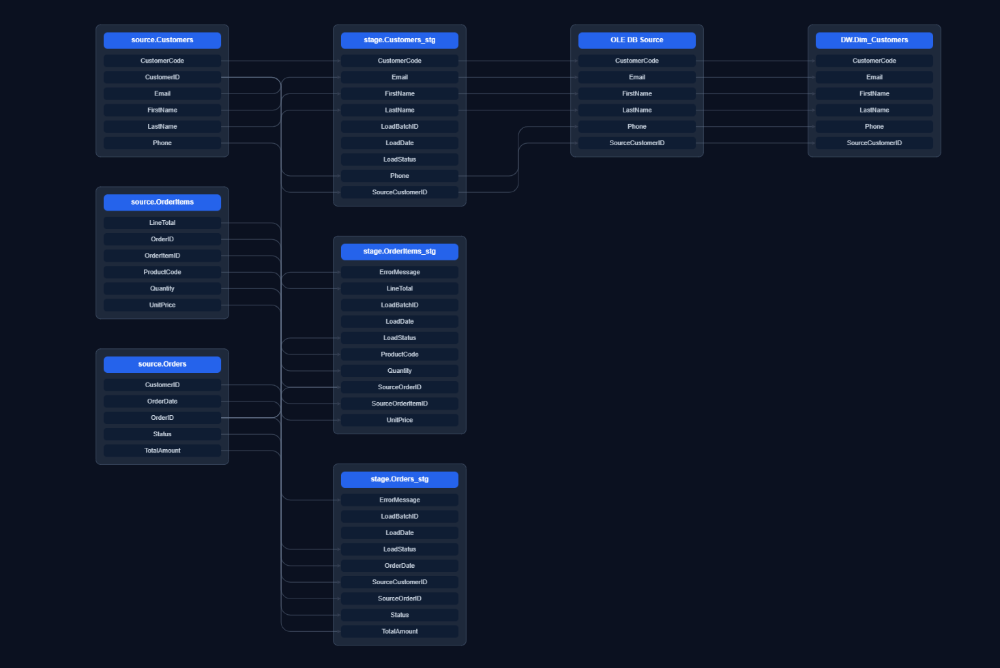

# SSIS Lineage Utility

[](LICENSE)
[](https://dotnet.microsoft.com/download/dotnet/10.0)
[](https://github.com/okutue/SSIS-Project-Documentation)
[](https://github.com/okutue/SSIS-Project-Documentation/releases)
[](https://github.com/okutue/SSIS-Project-Documentation#privacy--offline)

Scans Microsoft SSIS projects (`.dtproj` / `.dtsx`), builds a lineage graph (packages, tasks, data-flow components, column mappings, execution and data-flow edges), optionally enriches lineage from SQL Server stored procedures, and exports JSON, YAML, Neo4j Cypher, Markdown, HTML, CSV, Excel, Mermaid, OpenLineage, and PNG diagrams.

Key UI features: interactive data-flow diagram (object and column views, entry-package highlight, fullscreen, PNG export), **Lineage Search** (trace any column or table — including mid-stream/staging nodes — end-to-end, with **impact-analysis** (downstream-only) and **origins** (upstream-only) modes and CSV/PNG export), a tabbed **Detailed Report** (sortable/filterable grids, step-grouped column mappings, one-click Excel workbook export), and **save/load reports** (`.lineage.json`) so a scan can be reopened or shared without re-scanning.

CI integration: the CLI `diff` command compares two scans and fails the build on **lineage drift** — see [`docs/CI.md`](docs/CI.md).




## Install (from source — recommended)

The app builds against the Microsoft SSIS runtime assemblies on your machine, so running from source is the supported install:

```powershell
# 1. .NET 10 SDK (one-time)
winget install Microsoft.DotNet.SDK.10

# 2. Get the source — clone, or download "Source code (zip)" from the latest release and extract
git clone https://github.com/okutue/SSIS-Project-Documentation.git
cd SSIS-Project-Documentation

# 3. Copy the SSIS runtime DLLs into lib/ssis (one-time, auto-elevates to admin)
powershell -ExecutionPolicy Bypass -File setup-ssis-refs.ps1

# 4. Run the desktop app
dotnet run --project src/SsisLineage.Desktop -c Release
```

That's it — subsequent runs are just step 4. Releases on GitHub are **source-code releases**; download the `Source code (zip)` asset and follow the same steps.

## What gets parsed

| Area | Coverage |
|------|----------|
| Control flow | Execute SQL Task, Execute Package Task (recursive child packages), Data Flow Task, Sequence / ForEach / ForLoop containers, precedence constraints |
| Data flow | All pipeline components and paths; declared input/output column mappings; OLE DB source/destination table or SQL command; Lookup SQL |
| Inline SQL (Execute SQL tasks) | `INSERT…SELECT`, `SELECT INTO`, `UPDATE` (incl. `FROM…JOIN`), `DELETE` (target + join + filter), `MERGE` (insert/update actions, ON condition), CTEs (`WITH…`), `INSERT…EXEC`, `UNION` |
| Dynamic SQL | `EXEC(@var)` and `EXEC sp_executesql @var` — variable assignments (`SET @sql = '…' + …`) are reconstructed, parameters substituted, and the inner SQL re-parsed |
| Stored procedures | With *enrich data-flow SQL procedures* enabled, proc bodies are loaded from SQL Server (via project `.conmgr` connections or an override) and parsed with the full SQL grammar above — including join and filter conditions per column |
| Variables & parameters | Package variables and `Project.params` project parameters; variable-driven SQL statements (`SqlStatementSource = @[User::Var]`) are resolved to their design-time value |

## Known limitations

- **Script Task (control flow)** — compiled C#/VB code cannot be statically analysed. The task appears in the graph and a scan warning is raised, but any data movement done inside the script is **not** captured in lineage.
- **Script Component (data flow)** — its declared input/output columns are captured from the pipeline metadata, but the transformation logic between them is opaque; a scan warning identifies each one.
- **Third-party / custom components** (CozyRoc, KingswaySoft, ZappySys, …) — captured as nodes with whatever metadata the package exposes; column-level lineage may be incomplete (flagged with a warning).
- **Dynamic SQL built at runtime** — only variable values known at design time can be reconstructed. SQL assembled from runtime query results, environment-specific configuration, or expressions beyond simple concatenation is not traced.
- **SSIS expression language** — evaluation covers variable substitution and string concatenation only; functions/conditionals in expressions fall back to the raw expression text.
- **Execute SQL Task parameter/result bindings** — bindings (`@0 ← User::Var`) are captured and shown in the component drill-down, and positional `?` markers are substituted so the SQL parses; the bindings themselves are informational, not traced as column lineage.
- **OLE DB Command transformation** — its SQL is captured, but per-parameter column mappings are not expanded.
- **Native DTS runtime on .NET 10** — the Microsoft DTS assemblies are .NET Framework-only, so packages are parsed via the built-in XML parser (results are equivalent; the informational console message is expected). Event handlers (OnError, OnPostExecute, …) are walked by both parsers.
- **Design-time values** — connection strings, variables, and parameters reflect what is saved in the project by default. Use `scan --variable-overrides <file.json>` to apply values extracted from an SSIS catalog environment (see [`docs/CI.md`](docs/CI.md)).

## Requirements

| Component | Notes |
|-----------|-------|
| .NET SDK 10.0 | `winget install Microsoft.DotNet.SDK.10` |
| Windows 10/11 x64 | SSIS DTS assemblies are Windows-only |
| SSIS runtime assemblies | Provided by any of: full SQL Server 2017–2022, the **SSIS Projects** extension for Visual Studio 2017/2019/2022, or **SSMS 18–22** |

SSIS package parsing requires the Microsoft SSIS runtime DLLs present locally. Linux/macOS cannot run the DTS parser. See [First-time setup](#build) below.

## Solution layout

| Project | Purpose |
|---------|---------|
| `src/SsisLineage.Core` | Lineage engine (parse, cache, SQL enrich, exports) |
| `src/SsisLineage.Cli` | Console `scan` command |
| `src/SsisLineage.UI` | Shared Razor Class Library — MudBlazor UI, interactive Cytoscape DAG, services (used by both hosts) |
| `src/SsisLineage.Web` | Thin Blazor Server host (browser, for dev/advanced use) |
| `src/SsisLineage.Desktop` | Photino native desktop host (primary app — no web server, no open port) |
| `src/SsisLineage.Tests` | Unit tests (parsing and HTML anchors) |

The UI (Blazor + MudBlazor) lives once in `SsisLineage.UI` and is hosted two ways: a native desktop window (`SsisLineage.Desktop`, recommended) and a local web app (`SsisLineage.Web`). The interactive data-flow diagram is built on **Cytoscape.js** (vendored locally) — click any node or edge to drill into package/task/component/edge details and column lineage.

Additional docs: [`docs/SKILL.md`](docs/SKILL.md), [`docs/RULE.md`](docs/RULE.md).

## Build

**First time after cloning** — run the setup script once (requires admin, will auto-elevate):

```powershell
powershell -ExecutionPolicy Bypass -File setup-ssis-refs.ps1
```

This locates the SSIS runtime DLLs on your machine (GAC, Visual Studio extension, or SSMS) and copies them into `lib/ssis/`. See [`CONTRIBUTING.md`](CONTRIBUTING.md) for troubleshooting.

```powershell
dotnet build SsisLineage.slnx
dotnet test src/SsisLineage.Tests/SsisLineage.Tests.csproj
```

## CLI

```powershell
dotnet run --project src/SsisLineage.Cli -- scan `
  --project-path "<ssis-project-folder>" `
  --start-package "<root-package>.dtsx" `
  --output "./lineage-output"
```

Compare two scans for lineage drift (CI gate — see [`docs/CI.md`](docs/CI.md)):

```powershell
dotnet run --project src/SsisLineage.Cli -- diff `
  .\lineage-base\lineage.json .\lineage-pr\lineage.json `
  --output lineage-diff.md --fail-on-changes
```

Scan outputs: `lineage.json`, `lineage.yaml`, `lineage.cypher`, `execution-flow.md`, `lineage-report.html`, `lineage.mmd` (Mermaid), `lineage.openlineage.json` (OpenLineage). All exports automatically redact credential values.

Neo4j graph schema: [`docs/neo4j-schema.md`](docs/neo4j-schema.md).

Optional SQL procedure enrichment (uses override connection string or resolves from project `.conmgr` files):

```powershell
dotnet run --project src/SsisLineage.Cli -- scan `
  --project-path "<folder>" `
  --start-package "Root.dtsx" `
  --include-sql-procedures `
  --sql-connection-string "Server=.;Database=MyDb;Integrated Security=True;TrustServerCertificate=True"
```

## Desktop app (recommended)

```powershell
dotnet run --project src/SsisLineage.Desktop
```

Launches a native window — no web server, no open network port. Use **Browse…** to pick an SSIS project folder; the start package field autocompletes from the project's `.dtsx` files; recent projects are remembered locally.

## Web UI

```powershell
dotnet run --project src/SsisLineage.Web
```

Open `http://localhost:5057` (see `launchSettings.json`). Generate a report on the home page; the interactive diagram supports zoom/pan and click-to-drill-down; the column-lineage grid supports sort, per-column filters, global search, and column show/hide. Summary tiles deep-link to the **Detailed Report** tabs.

## Privacy / offline

Everything runs **fully local**. There are no cloud calls, no telemetry, and no CDN dependencies — MudBlazor and Cytoscape.js assets are vendored and served from the app itself. The desktop host has no web server or open port at all. Your SSIS projects never leave your machine. Recent-project history is stored locally under `%APPDATA%\SsisLineage`.

## Sample SSIS assets

Place synthetic sample projects under `test-assets/SampleSsis` (not committed by default). Use fake connection strings and servers per [`docs/RULE.md`](docs/RULE.md). Validate against a real project at `C:\Project\SSIS\` when available.

## Security

Do not commit connection strings, passwords, or customer-specific metadata. Redact sensitive values in logs and shared outputs; see [`docs/RULE.md`](docs/RULE.md).

## License

[MIT](LICENSE)
